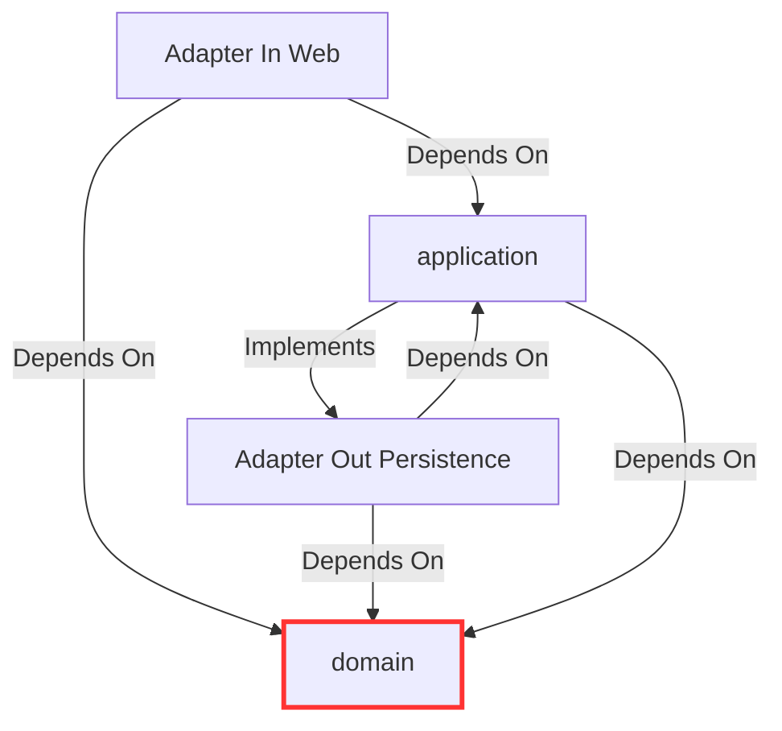

# Architecture

Superhero Battle Arena is a Spring Boot application that simulates battles between teams of superheroes.

This document describes the high-level architecture and the strict constraints governing module boundaries.

## Module Boundaries

The core source code lives inside `src/main/java/org/barcelonajug/superherobattlearena/` and is split into three strict top-level modules.

### `domain`

The core business models and algorithms.

- Contains Entities (e.g., `Hero`, `Match`), Value Objects (`PowerStats`), and domain invariants.
- **Constraints:**
  - `domain` **must NOT** depend on `application` or `adapter`.
  - `domain` **must NOT** depend on Spring Framework, JPA, Jackson, or any other external framework (except for basic logging and JSpecify `NullMarked` annotations).
  - Use Java `record`s where immutability is guaranteed.

### `application`

The use case orchestrator that implements business flows.

- Contains the `usecase` and `port.out` (interfaces for external services like repositories).
- **Constraints:**
  - `application` **must NOT** depend on `adapter`.
  - Can depend on `domain` and Spring Core (`@Service` annotations are allowed).
  - Outbound data access MUST be done via interfaces defined in `port.out`.
  - Web DTOs or JPA Entities must never leak into this module.

### `adapter`

The outer boundary connecting to the outside world.

- Divided into `in.web` (Controllers, DTOs) and `out.persistence` (Spring Data Repositories, JPA Entities, Mappers).
- **Constraints:**
  - `adapter` depends on both `domain` and `application`.
  - Submodules within `adapter` (e.g., `in` and `out`) **must NOT** depend on each other. `adapter.in` cannot call `adapter.out` repositories directly; they must go through an `application` use case.
  - Mapping between Domain objects and external formats (DTOs/JPA entities) MUST happen at the boundary edge within `adapter`.

## Summary of Dependency Rules

- **ALLOWED:** `adapter` -> `application` -> `domain`
- **FORBIDDEN:** `domain` -> `*`
- **FORBIDDEN:** `application` -> `adapter`
- **FORBIDDEN:** `adapter.in` <-> `adapter.out`
