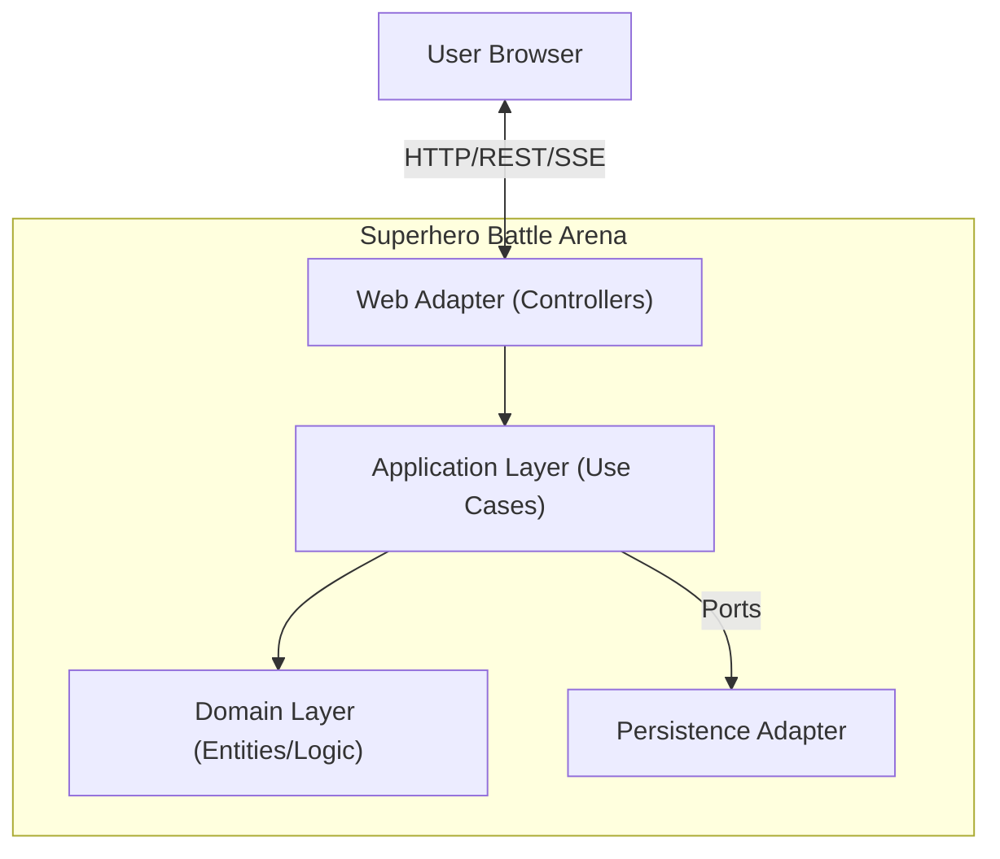
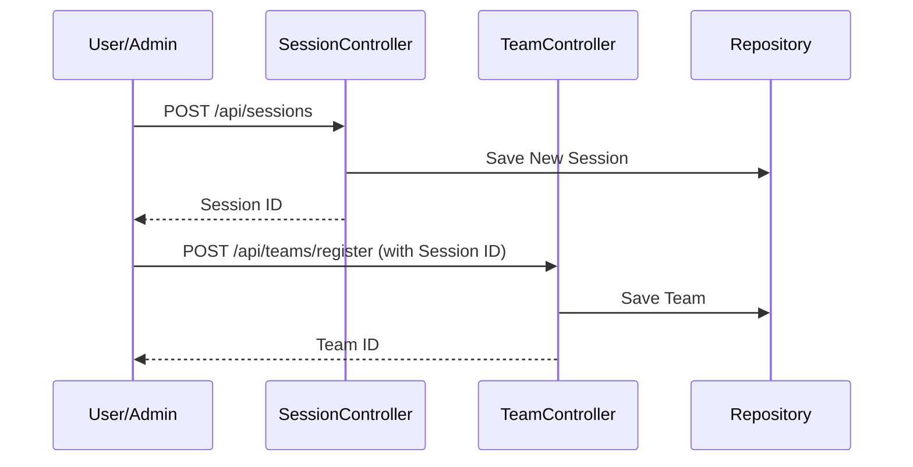
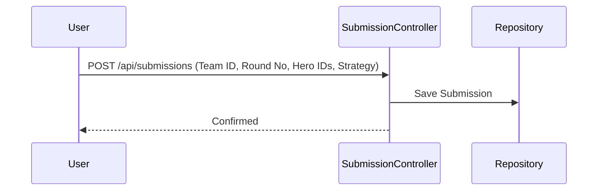
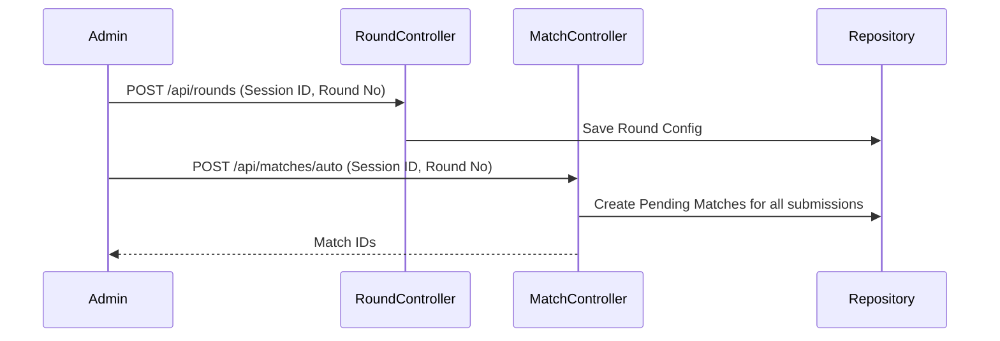
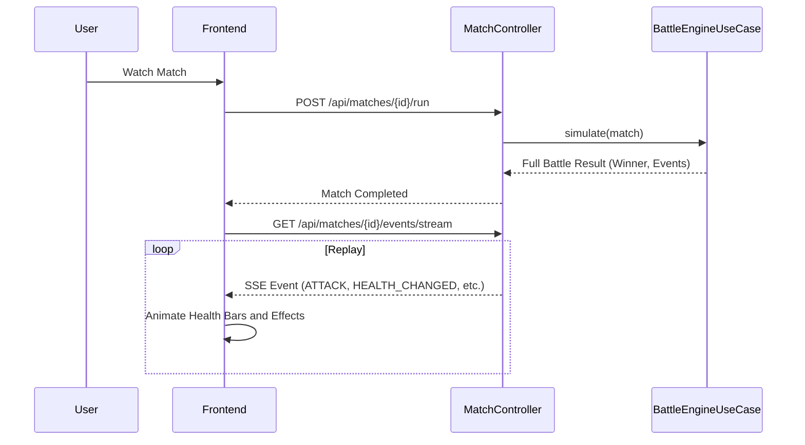
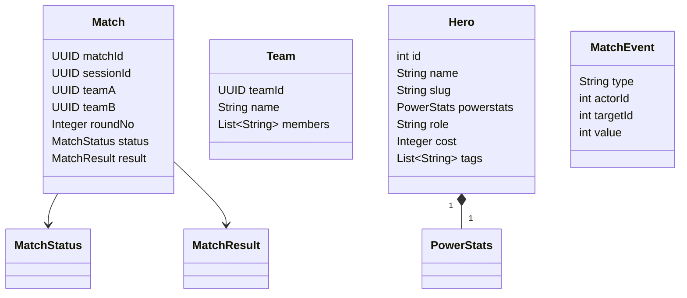

# Superhero Battle Arena


[](https://deepwiki.com/anyulled/superhero-battle-arena)

| | |
| :---: | :---: |
| [](https://barcelonajug.org) | [](https://talentarena.tech) |

A Spring Boot application built with Hexagonal Architecture that simulates battles between teams of superheroes.

## Features

- **Team Management**: Register your team of superheroes.
- **Squad Formation**: Submit specific hero lineups and strategies for each round.
- **Matchmaking**: Create matches between two registered teams within a session.
- **Battle Simulation**: Deterministic battle engine with turn-based combat mechanics and fatigue system.
- **Live Replay**: Watch battles unfold in real-time via Server-Sent Events (SSE) with visual animations.
- **Hexagonal Architecture**: Clean separation of concerns with Domain, Application (Use Cases), and Adapter layers.

## Technology Stack

- **Backend**: Java 25 (Preview Features), Spring Boot 4.x
- **Frontend**: HTML5, Tailwind CSS, jQuery, Lucide Icons
- **Architecture**: Hexagonal (Ports & Adapters) with Use Case pattern
- **Build Tool**: Maven

## How to Run

1. **Prerequisites**: Ensure you have Java 21+ installed (Java 25 recommended for full compatibility).
2. **Build and Run**:

   ```bash
   ./mvnw spring-boot:run
   ```

### Spring Profiles

The application supports different environments through Spring profiles:

- **`h2` (Default)**: Uses an in-memory H2 database. Perfect for local development.

  ```bash
  ./mvnw spring-boot:run -Dspring-boot.run.profiles=h2
  ```

- **`postgres`**: Uses an external PostgreSQL database managed by **Docker Compose**. Spring Boot will automatically start a PostgreSQL container using `docker-compose.yml`.

  ```bash
  ./mvnw spring-boot:run -Dspring-boot.run.profiles=postgres
  ```

#### Troubleshooting Podman

If you are using **Podman** instead of Docker, the `spring-boot-docker-compose` module may fail to find the `docker` command. You can resolve this by:

1. **Creating a symlink** (recommended):

   ```bash
   sudo ln -s $(which podman) /usr/local/bin/docker
   ```

2. **Ensuring the Podman machine is running**:

   ```bash
   podman machine start
   ```

3. **Setting the `DOCKER_HOST`** if necessary:

   ```bash
   export DOCKER_HOST="unix://$(podman machine inspect --format '{{.RuntimeDirectories.Internal}}' | jq -r '.[0]')/podman.sock"
   ```

4. **Fixing Credential Helper Errors**:

   If you see an error like `exec: "docker-credential-desktop": executable file not found`, it's because your `~/.docker/config.json` is configured to use Docker Desktop's credential store. Fix it by removing the `credsStore` line:

   ```bash
   sed -i '' '/"credsStore": "desktop"/d' ~/.docker/config.json
   ```

5. **Access the Application**:

   Open your browser to [http://localhost:8080/](http://localhost:8080/) (the main entry point).

6. **API Documentation**:
   - Swagger UI: [http://localhost:8080/swagger-ui.html](http://localhost:8080/swagger-ui.html)
   - OpenAPI JSON: [http://localhost:8080/v3/api-docs](http://localhost:8080/v3/api-docs)

## Architecture

### System Overview



## Battle Flow

The system flow is divided into four main phases: Registration, Squad Submission, Matchmaking, and Battle.

### Phase 1: Registration (Session & Teams)



### Phase 2: Squad Submission

Before a match can be run for a specific round, teams must submit their squad (list of heroes) and strategy.



### Phase 3: Matchmaking & Round Setup



### Phase 4: Battle Simulation & Visualization



## Domain Model

Key domain entities use the **Builder Pattern** and are implemented as Java **Records** where immutable data transfer is required.



### Match Events

The simulation generates various event types delivered via SSE:

- `START_BATTLE`: Initialization of the combat scene.
- `ATTACK`: When a hero performs an action.
- `HEALTH_CHANGED`: Updates hero health bars in the UI.
- `BATTLE_OVER`: Final result including the winner.

## Usage Guide

1. **Home**: Start at `index.html`.
2. **Lobby**: Manage teams and see active sessions. Registration is done via API (see samples in `/lobby.html`).
3. **Admin**: Configure rounds and trigger auto-matchmaking.
4. **Current Bracket**: View the tournament progress on `bracket.html`.
5. **Watch Battle**: Experience the real-time simulation on `battle.html`.

## Command-Line Tools

The repository includes several utility scripts for data initialization and SQL generation.

See the [Scripts Documentation](scripts/README.md) for detailed instructions on using JBang to:

- Initialize test fixtures (`InitFixture.java`)
- Generate seed SQL from JSON (`GenerateSuperheroSql.java`)
- Extract hero data (`ExtractHeroes.java`)

## Development

The project structure follows Hexagonal Architecture principles:

- `domain`: Pure business logic and entities. No framework dependencies.
- `application`: Use cases (service layer) and input/output ports.
- `adapter`: Implementation of ports (Web/Rest, Persistence/JPA).
