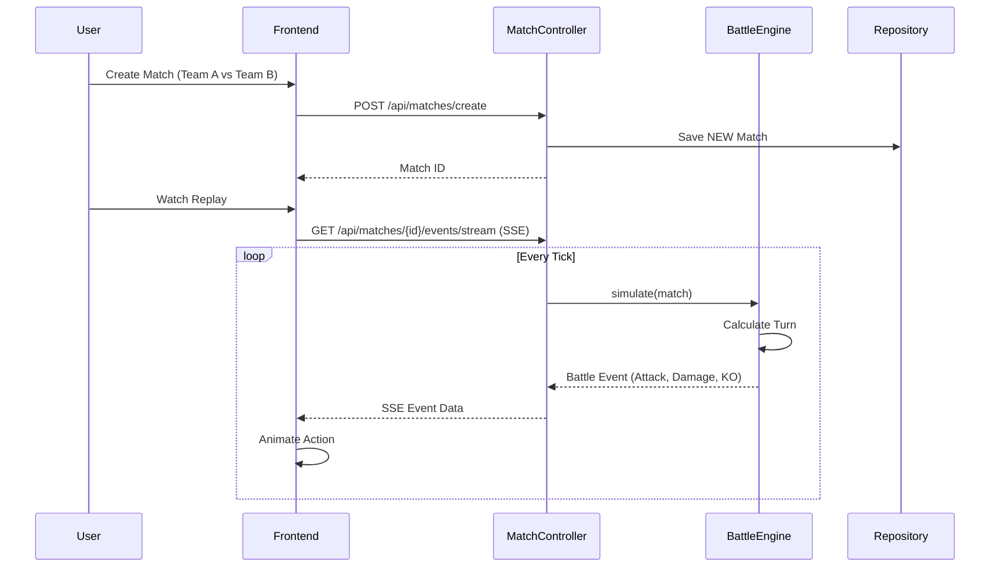
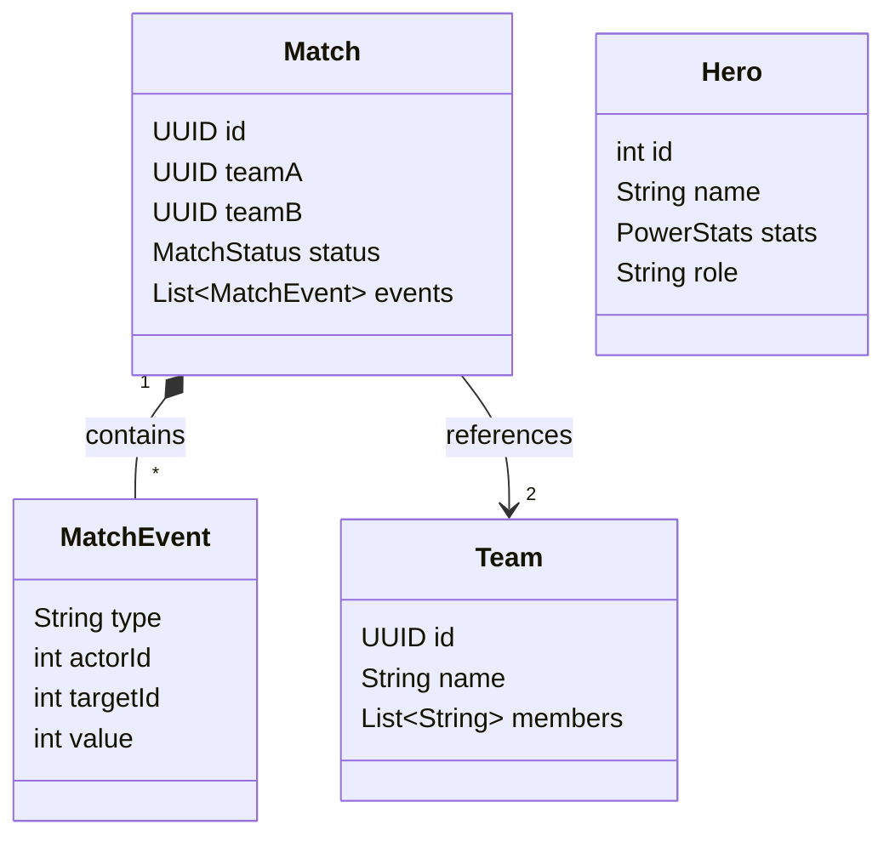

# Superhero Battle Arena

A Spring Boot application built with Hexagonal Architecture that simulates battles between teams of superheroes.

## Features

- **Team Management**: Register your team of superheroes.
- **Matchmaking**: Create matches between two registered teams.
- **Battle Simulation**: Deterministic battle engine with turn-based combat mechanics.
- **Live Replay**: Watch battles unfold in real-time via Server-Sent Events (SSE) with visual animations.
- **Hexagonal Architecture**: Clean separation of concerns with Domain, Application, and Adapter layers.

## Technology Stack

- **Backend**: Java 25 (Preview Features), Spring Boot 3.4
- **Frontend**: HTML5, Tailwind CSS, jQuery
- **Architecture**: Hexagonal (Ports & Adapters)
- **Build Tool**: Maven

## How to Run

1. **Prerequisites**: Ensure you have Java 21+ installed.
2. **Build and Run**:

   ```bash
   ./mvnw spring-boot:run
   ```

3. **Access the Application**:
   Open your browser to [http://localhost:8080/lobby.html](http://localhost:8080/lobby.html)

## Architecture

### System Overview

```mermaid
graph TD
    User[User Browser]
    
    subgraph "Superhero Battle Arena"
        Web[Web Adapter\n(Controllers)]
        App[Application Layer\n(Services/Use Cases)]
        Domain[Domain Layer\n(Entities/Logic)]
        Persist[Persistence Adapter]
    end
    
    User <-->|HTTP/REST/SSE| Web
    Web --> App
    App --> Domain
    App -->|Ports| Persist
```

### Battle Flow



### Domain Model



## Usage Guide

1. **Lobby**: Go to `/lobby.html`. Use the buttons to register default teams if none exist.
2. **Create Match**: Select two teams from the list and click "Create Match".
3. **Bracket**: You will be redirected to `/bracket.html`. Click "Watch Live/Replay" on your match.
4. **Battle**: Watch the simulation on `/battle.html`.

## Development

The project structure follows Hexagonal Architecture principles:

- `domain`: Pure business logic and entities. No framework dependencies.
- `application`: Use cases and input/output ports.
- `adapter`: Implementation of ports (Web, Persistence).
